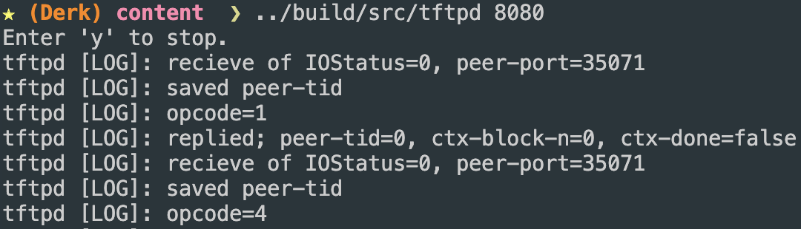

# README

### Brief
This is my first ever working, toy TFTP server written with modern C++ using the BSD socket library.

### Showcase of operation

### Getting Started
 - Ensure you have CMake 3.28+, the Ninja build system, and a modern C++ compiler.
 - Enter `./utility.sh build local-debug-build 1` to build the program.
 - Enter `cd ./content` to enter the sample file directory.
 - Enter `../build/src/tftpd 8080` to run the server.
 - Enter `tftp` on some computer and then enter the following commands:
    - `connect <ip-of-server-computer> <server-port>`
    - `get about.txt`
 - The transfer should work.

### Caveats
 - This is barely tested only on macOS so far.
 - The server is single threaded.
 - The server lacks much configuration.
